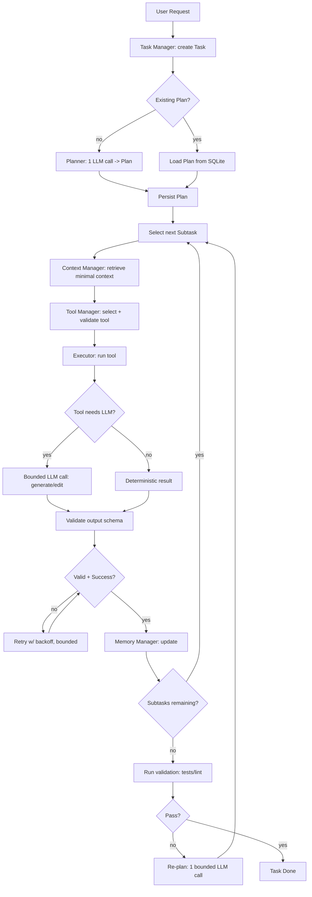
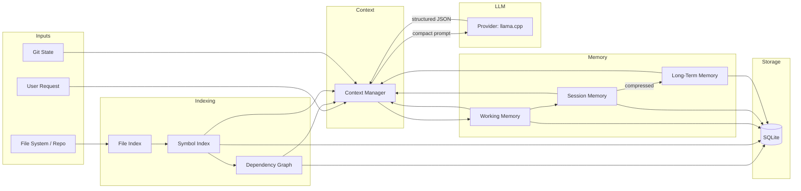
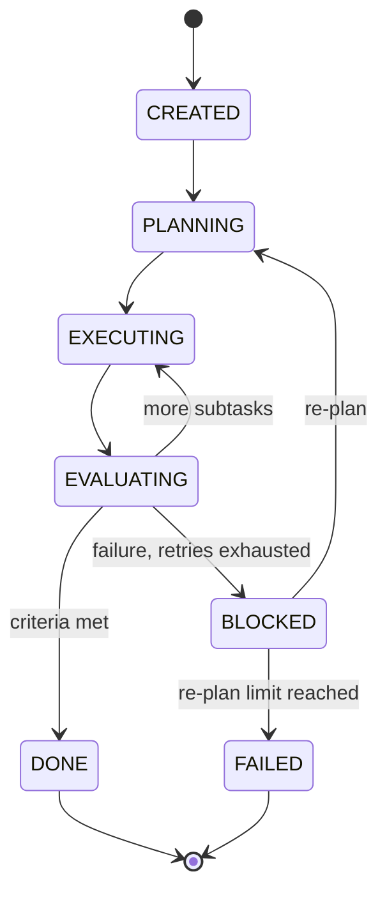
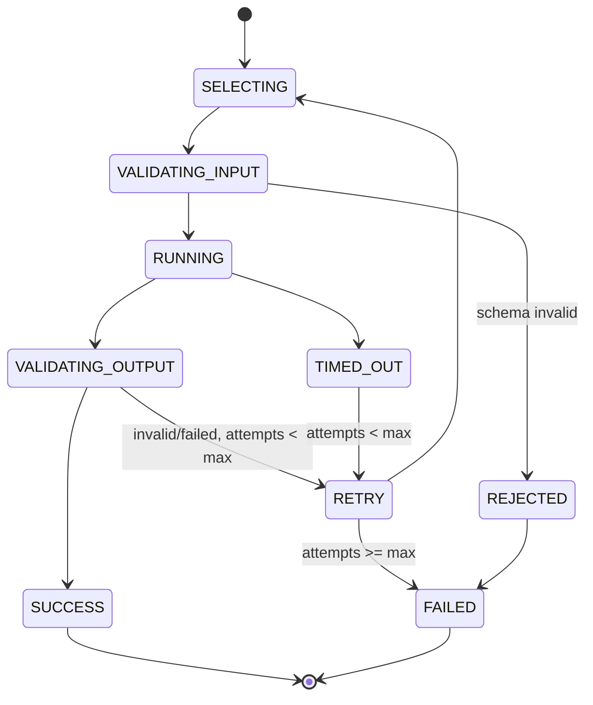

# Indra — Architecture & Implementation Plan

A Claude-Code-style agentic coding harness, purpose-built for **2B–4B local
GGUF models** running on **4GB-VRAM GPUs via llama.cpp**. Every design
decision trades model intelligence for architecture: more state machines,
more retrieval, more validation — fewer tokens, fewer LLM calls, fewer
surprises.

---

## 1. Design Philosophy

| Principle | Implication |
|---|---|
| Small models can't hold large context | Retrieval > context stuffing |
| Small models can't self-correct reliably | Deterministic state machine drives the loop, not the model |
| Small models hallucinate free text | Every model output is JSON, schema-validated |
| Small models can't plan long horizons | Plans are flat lists of tiny subtasks, re-planned on failure |
| LLM calls are the most expensive resource | Budget calls per task; tools do the heavy lifting |
| One model loaded at a time | Single-agent runtime, no multi-agent orchestration |

Indra is not "an LLM that uses tools." It is a **deterministic workflow
engine that occasionally consults a small LLM** for the few decisions that
genuinely require language understanding (writing a diff, naming a
variable, picking the next subtask).

---

## 2. Directory Structure

```
indra/
├── pyproject.toml
├── indra.config.yaml
├── README.md
├── docs/
│   ├── architecture.md
│   ├── plugin_guide.md
│   ├── api.md
│   └── deployment.md
├── src/
│   └── indra/
│       ├── __init__.py
│       ├── core/
│       │   ├── __init__.py
│       │   ├── agent.py              # AgentRuntime - the single loop
│       │   ├── task_manager.py
│       │   ├── planner.py
│       │   ├── executor.py
│       │   ├── tool_manager.py
│       │   ├── memory_manager.py
│       │   ├── session_manager.py
│       │   ├── context_manager.py
│       │   ├── prompt_manager.py
│       │   ├── state_machine.py
│       │   ├── capability_profiler.py # detects HW/model, derives tuned config
│       │   └── run_profile.py         # thinking-level/reasoning-effort/max-steps
│       ├── workspaces/
│       │   ├── __init__.py
│       │   └── workspace_manager.py   # project sandboxing, path containment
│       ├── integrations/
│       │   ├── __init__.py
│       │   └── telegram/
│       │       ├── __init__.py
│       │       ├── telegram_client.py # thin Bot API wrapper (poll/send)
│       │       ├── telegram_bridge.py # two-way message <-> agent bridge
│       │       └── telegram.config.example.json
│       ├── coding/
│       │   ├── __init__.py
│       │   ├── code_generator.py
│       │   ├── code_editor.py
│       │   ├── patch.py              # diff/patch primitives
│       │   ├── refactor.py
│       │   ├── repo_explorer.py
│       │   ├── dependency_graph.py
│       │   ├── symbol_index.py
│       │   ├── file_index.py
│       │   └── ast_inspect.py        # tree-sitter wrappers
│       ├── memory/
│       │   ├── __init__.py
│       │   ├── working_memory.py
│       │   ├── session_memory.py
│       │   ├── long_term_memory.py
│       │   └── compression.py
│       ├── tools/
│       │   ├── __init__.py
│       │   ├── base.py               # Tool protocol, registry
│       │   ├── file_tools.py
│       │   ├── shell_tools.py
│       │   ├── search_tools.py       # local repo grep/symbol search
│       │   ├── web_search_tools.py   # fast external web search + fetch
│       │   ├── git_tools.py
│       │   ├── python_exec_tools.py
│       │   ├── test_tools.py
│       │   ├── build_tools.py
│       │   └── telegram_tools.py     # notify_telegram, ask_telegram tools
│       ├── providers/
│       │   ├── __init__.py
│       │   ├── base.py               # ModelProvider protocol
│       │   ├── llama_cpp_provider.py
│       │   ├── ollama_provider.py
│       │   ├── openai_compat_provider.py
│       │   ├── vllm_provider.py
│       │   └── lmstudio_provider.py
│       ├── plugins/
│       │   ├── __init__.py
│       │   └── registry.py
│       ├── prompts/
│       │   ├── __init__.py
│       │   ├── loader.py
│       │   ├── planner.prompt.yaml
│       │   ├── executor.prompt.yaml
│       │   ├── summarizer.prompt.yaml
│       │   ├── memory.prompt.yaml
│       │   └── retrieval.prompt.yaml
│       ├── schemas/
│       │   ├── __init__.py
│       │   ├── plan.py
│       │   ├── tool_call.py
│       │   ├── evaluation.py
│       │   ├── memory.py
│       │   └── task.py
│       ├── storage/
│       │   ├── __init__.py
│       │   ├── db.py                 # SQLite connection mgmt
│       │   ├── migrations/
│       │   │   └── 0001_init.sql
│       │   └── repositories.py       # data-access objects
│       ├── observability/
│       │   ├── __init__.py
│       │   ├── logging.py
│       │   ├── metrics.py
│       │   ├── tracing.py
│       │   └── token_tracker.py
│       ├── config/
│       │   ├── __init__.py
│       │   ├── schema.py             # pydantic/dataclass config models
│       │   └── loader.py
│       ├── api/
│       │   ├── __init__.py
│       │   ├── app.py                # FastAPI app factory
│       │   ├── routes/
│       │   │   ├── sessions.py
│       │   │   ├── tasks.py
│       │   │   ├── memory.py
│       │   │   └── logs.py
│       │   └── deps.py
│       └── cli/
│           ├── __init__.py
│           ├── main.py               # entrypoint, dispatches subcommands
│           ├── chat.py
│           ├── run.py
│           ├── plan.py
│           ├── memory.py
│           ├── tools.py
│           ├── config.py
│           ├── doctor.py
│           ├── workspace.py
│           └── telegram.py           # `indra telegram serve`
├── telegram.config.json              # user's real bot token + chat id (gitignored)
├── tests/
│   ├── unit/
│   ├── integration/
│   └── e2e/
└── scripts/
    ├── index_repo.py
    └── bench_llm_calls.py
```

**Rule enforced by this layout:** `cli/` never imports from `core/`,
`coding/`, `memory/`, or `tools/` directly — it only calls `api/`. This
keeps the CLI a thin HTTP client and the API the single source of truth,
satisfying "CLI communicates through API."

---

## 3. Module Responsibilities

### Core
| Module | Responsibility |
|---|---|
| `agent.py` | Owns the agent loop; ties task/planner/executor/memory/context together |
| `task_manager.py` | CRUD for tasks; tracks task state transitions |
| `planner.py` | Produces a `Plan` (goal, constraints, subtasks) via one bounded LLM call |
| `executor.py` | Executes one subtask: selects tool, runs it, captures result |
| `tool_manager.py` | Tool registry, validation, retries, timeouts |
| `memory_manager.py` | Facade over working/session/long-term memory + compression |
| `session_manager.py` | Session lifecycle, persistence, resumption |
| `context_manager.py` | Assembles the minimal prompt context for each LLM call |
| `prompt_manager.py` | Loads, renders, and versions prompt templates |
| `state_machine.py` | Generic FSM used by task lifecycle and agent loop |
| `capability_profiler.py` | Detects VRAM/RAM/CPU + model metadata, derives tuned `ModelConfig`/`AgentConfig` |
| `run_profile.py` | Resolves CLI `--thinking-level` / `--reasoning-effort` / `--max-steps` into concrete budgets |

### Coding
| Module | Responsibility |
|---|---|
| `code_generator.py` | Wraps LLM calls that must emit new code (small, scoped) |
| `code_editor.py` | Applies patches/edits to files; orchestrates AST vs text fallback |
| `patch.py` | Unified-diff parsing/generation, line-edit primitives |
| `refactor.py` | Deterministic refactor operations (rename, extract) where possible |
| `repo_explorer.py` | High-level repo queries built on the indexes below |
| `dependency_graph.py` | Import graph construction & queries |
| `symbol_index.py` | Function/class/symbol table, built via tree-sitter |
| `file_index.py` | File listing, hashing, change detection for incremental indexing |
| `ast_inspect.py` | Thin tree-sitter wrapper: parse, query, extract nodes |

### Memory
`working_memory.py` (active task only, in-process + SQLite mirror),
`session_memory.py` (current session transcript summary),
`long_term_memory.py` (preferences, repo knowledge, tool history, decisions),
`compression.py` (summarization, dedup, chunking, relevance scoring — all
deterministic/non-LLM where possible, e.g. embedding similarity + recency).

### Workspaces
| Module | Responsibility |
|---|---|
| `workspace_manager.py` | Creates/lists/switches project workspaces; enforces that every file/shell/git tool call is sandboxed to the active workspace's `root_path` (path-containment check on every resolved path, symlink-safe) |

### Integrations
| Module | Responsibility |
|---|---|
| `telegram_client.py` | Long-polls `getUpdates`, calls `sendMessage`; no business logic |
| `telegram_bridge.py` | Deterministic command router: maps Telegram messages to API calls (new task, status, approve, cancel) without an LLM call |

### Tools
Each tool module exposes a set of `Tool` instances registered at import
time. `base.py` defines the `Tool` protocol and the `ToolRegistry`.
`web_search_tools.py` and `telegram_tools.py` are detailed in §25 and §24.

### Observability
`logging.py` (structlog-based JSON logs), `metrics.py` (counters/timers,
written to SQLite or local file), `tracing.py` (span IDs per agent-loop
iteration), `token_tracker.py` (per-call and per-task token accounting,
enforces the LLM call budget).

---

## 4. Core Interfaces

```python
# core/agent.py
from __future__ import annotations

from dataclasses import dataclass
from typing import Protocol

from indra.schemas.task import Task, TaskResult


class AgentRuntime:
    """Single-agent loop. Owns no LLM state across tasks beyond memory."""

    def __init__(
        self,
        task_manager: "TaskManager",
        planner: "Planner",
        executor: "Executor",
        memory_manager: "MemoryManager",
        context_manager: "ContextManager",
    ) -> None:
        self._tasks = task_manager
        self._planner = planner
        self._executor = executor
        self._memory = memory_manager
        self._context = context_manager

    def run_task(self, task: Task) -> TaskResult:
        """Drive one task through plan -> execute -> evaluate to completion."""
        ...

    def resume_task(self, task_id: str) -> TaskResult:
        """Resume an interrupted task from its persisted state."""
        ...
```

```python
# tools/base.py
from __future__ import annotations

from dataclasses import dataclass
from typing import Any, Protocol


@dataclass(frozen=True)
class ToolSchema:
    name: str
    description: str
    input_schema: dict[str, Any]
    output_schema: dict[str, Any]


@dataclass(frozen=True)
class ToolResult:
    success: bool
    output: Any
    error: str | None = None
    duration_ms: int = 0


class Tool(Protocol):
    schema: ToolSchema

    def run(self, params: dict[str, Any]) -> ToolResult:
        ...


class ToolRegistry:
    def __init__(self) -> None:
        self._tools: dict[str, Tool] = {}

    def register(self, tool: Tool) -> None:
        self._tools[tool.schema.name] = tool

    def get(self, name: str) -> Tool:
        if name not in self._tools:
            raise KeyError(f"Unknown tool: {name}")
        return self._tools[name]

    def list_schemas(self) -> list[ToolSchema]:
        return [t.schema for t in self._tools.values()]
```

```python
# providers/base.py
from __future__ import annotations

from dataclasses import dataclass
from typing import Protocol


@dataclass(frozen=True)
class CompletionRequest:
    prompt: str
    max_tokens: int
    temperature: float = 0.0
    json_schema: dict | None = None
    stop: tuple[str, ...] = ()


@dataclass(frozen=True)
class CompletionResponse:
    text: str
    prompt_tokens: int
    completion_tokens: int
    raw: dict


class ModelProvider(Protocol):
    def complete(self, request: CompletionRequest) -> CompletionResponse:
        ...

    def is_available(self) -> bool:
        ...
```

```python
# plugins/registry.py
from __future__ import annotations

from dataclasses import dataclass
from typing import Callable


@dataclass(frozen=True)
class PluginMeta:
    name: str
    kind: str  # "tool" | "memory_provider" | "retrieval_provider" |
               # "model_provider" | "workflow_stage"


class PluginRegistry:
    """Simple registry, no DI container. Plugins call register_* at import."""

    def __init__(self) -> None:
        self._factories: dict[str, Callable[..., object]] = {}
        self._meta: dict[str, PluginMeta] = {}

    def register(self, meta: PluginMeta, factory: Callable[..., object]) -> None:
        self._factories[meta.name] = factory
        self._meta[meta.name] = meta

    def create(self, name: str, **kwargs: object) -> object:
        return self._factories[name](**kwargs)

    def list_by_kind(self, kind: str) -> list[PluginMeta]:
        return [m for m in self._meta.values() if m.kind == kind]


REGISTRY = PluginRegistry()
```

---

## 5. Data Models

```python
# schemas/task.py
from __future__ import annotations

from dataclasses import dataclass, field
from datetime import datetime
from enum import Enum


class TaskStatus(str, Enum):
    CREATED = "created"
    PLANNING = "planning"
    EXECUTING = "executing"
    EVALUATING = "evaluating"
    BLOCKED = "blocked"
    DONE = "done"
    FAILED = "failed"


@dataclass
class Task:
    id: str
    session_id: str
    description: str
    status: TaskStatus = TaskStatus.CREATED
    created_at: datetime = field(default_factory=datetime.utcnow)
    updated_at: datetime = field(default_factory=datetime.utcnow)
    plan_id: str | None = None
    metadata: dict[str, str] = field(default_factory=dict)


@dataclass
class TaskResult:
    task_id: str
    status: TaskStatus
    summary: str
    artifacts: list[str] = field(default_factory=list)
    llm_calls_used: int = 0
```

```python
# schemas/plan.py
from __future__ import annotations

from dataclasses import dataclass, field


@dataclass(frozen=True)
class Subtask:
    id: str
    description: str
    depends_on: tuple[str, ...] = ()
    tool_hint: str | None = None
    done: bool = False


@dataclass(frozen=True)
class Plan:
    id: str
    task_id: str
    goal: str
    constraints: tuple[str, ...]
    assumptions: tuple[str, ...]
    subtasks: tuple[Subtask, ...]
    success_criteria: tuple[str, ...]
    version: int = 1
```

```python
# schemas/tool_call.py
from __future__ import annotations

from dataclasses import dataclass
from typing import Any


@dataclass(frozen=True)
class ToolCall:
    tool_name: str
    params: dict[str, Any]
    reason: str


@dataclass(frozen=True)
class ToolCallEvaluation:
    success: bool
    matches_intent: bool
    notes: str
    needs_replan: bool = False
```

```python
# schemas/memory.py
from __future__ import annotations

from dataclasses import dataclass
from datetime import datetime


@dataclass(frozen=True)
class MemoryItem:
    id: str
    scope: str  # "working" | "session" | "long_term"
    kind: str   # "fact" | "preference" | "decision" | "tool_usage" | "summary"
    content: str
    relevance: float
    created_at: datetime
    source_task_id: str | None = None
```

---

## 6. Agent Workflow Diagram



---

## 7. Data Flow Diagram



---

## 8. State Machine Diagrams

### Task lifecycle



### Tool execution (per subtask)



Both FSMs are implemented once in `core/state_machine.py` as a small
generic `StateMachine[S, E]` and reused, not duplicated.

---

## 9. SQLite Schema Design

```sql
-- storage/migrations/0001_init.sql

PRAGMA journal_mode = WAL;
PRAGMA foreign_keys = ON;

CREATE TABLE workspaces (
    id            TEXT PRIMARY KEY,
    name          TEXT NOT NULL UNIQUE,
    root_path     TEXT NOT NULL UNIQUE,
    created_at    TEXT NOT NULL,
    is_default    INTEGER NOT NULL DEFAULT 0
);

CREATE TABLE sessions (
    id            TEXT PRIMARY KEY,
    workspace_id  TEXT NOT NULL REFERENCES workspaces(id) ON DELETE CASCADE,
    repo_path     TEXT NOT NULL,
    created_at    TEXT NOT NULL,
    updated_at    TEXT NOT NULL,
    status        TEXT NOT NULL DEFAULT 'active'
);
CREATE INDEX idx_sessions_workspace ON sessions(workspace_id);

CREATE TABLE tasks (
    id            TEXT PRIMARY KEY,
    session_id    TEXT NOT NULL REFERENCES sessions(id) ON DELETE CASCADE,
    description   TEXT NOT NULL,
    status        TEXT NOT NULL,
    plan_id       TEXT,
    created_at    TEXT NOT NULL,
    updated_at    TEXT NOT NULL,
    metadata_json TEXT NOT NULL DEFAULT '{}'
);
CREATE INDEX idx_tasks_session ON tasks(session_id);

CREATE TABLE plans (
    id                TEXT PRIMARY KEY,
    task_id           TEXT NOT NULL REFERENCES tasks(id) ON DELETE CASCADE,
    version           INTEGER NOT NULL DEFAULT 1,
    goal              TEXT NOT NULL,
    constraints_json  TEXT NOT NULL DEFAULT '[]',
    assumptions_json  TEXT NOT NULL DEFAULT '[]',
    success_json      TEXT NOT NULL DEFAULT '[]',
    created_at        TEXT NOT NULL
);

CREATE TABLE subtasks (
    id            TEXT PRIMARY KEY,
    plan_id       TEXT NOT NULL REFERENCES plans(id) ON DELETE CASCADE,
    description   TEXT NOT NULL,
    depends_on    TEXT NOT NULL DEFAULT '[]',
    tool_hint     TEXT,
    done          INTEGER NOT NULL DEFAULT 0,
    seq           INTEGER NOT NULL
);
CREATE INDEX idx_subtasks_plan ON subtasks(plan_id);

CREATE TABLE tool_calls (
    id            TEXT PRIMARY KEY,
    task_id       TEXT NOT NULL REFERENCES tasks(id) ON DELETE CASCADE,
    subtask_id    TEXT REFERENCES subtasks(id),
    tool_name     TEXT NOT NULL,
    params_json   TEXT NOT NULL,
    result_json   TEXT,
    success       INTEGER,
    duration_ms   INTEGER,
    created_at    TEXT NOT NULL
);
CREATE INDEX idx_toolcalls_task ON tool_calls(task_id);

CREATE TABLE memory_items (
    id            TEXT PRIMARY KEY,
    scope         TEXT NOT NULL,         -- working|session|long_term
    kind          TEXT NOT NULL,
    content       TEXT NOT NULL,
    relevance     REAL NOT NULL DEFAULT 0.5,
    session_id    TEXT REFERENCES sessions(id),
    source_task_id TEXT REFERENCES tasks(id),
    created_at    TEXT NOT NULL,
    embedding     BLOB                   -- optional, for similarity retrieval
);
CREATE INDEX idx_memory_scope ON memory_items(scope, relevance DESC);

CREATE TABLE repo_files (
    path          TEXT NOT NULL,
    workspace_id  TEXT NOT NULL REFERENCES workspaces(id) ON DELETE CASCADE,
    repo_path     TEXT NOT NULL,
    hash          TEXT NOT NULL,
    language      TEXT,
    size_bytes    INTEGER,
    last_indexed  TEXT NOT NULL,
    PRIMARY KEY (workspace_id, path)
);

CREATE TABLE repo_symbols (
    id            TEXT PRIMARY KEY,
    workspace_id  TEXT NOT NULL REFERENCES workspaces(id) ON DELETE CASCADE,
    file_path     TEXT NOT NULL,          -- logical ref: (workspace_id, file_path) -> repo_files
    symbol_name   TEXT NOT NULL,
    symbol_kind   TEXT NOT NULL,         -- function|class|method|variable
    start_line    INTEGER NOT NULL,
    end_line      INTEGER NOT NULL,
    signature     TEXT
);
CREATE INDEX idx_symbols_name ON repo_symbols(workspace_id, symbol_name);
CREATE INDEX idx_symbols_file ON repo_symbols(workspace_id, file_path);

CREATE TABLE repo_imports (
    id            TEXT PRIMARY KEY,
    workspace_id  TEXT NOT NULL REFERENCES workspaces(id) ON DELETE CASCADE,
    file_path     TEXT NOT NULL,          -- logical ref: (workspace_id, file_path) -> repo_files
    imported_path TEXT NOT NULL
);
CREATE INDEX idx_imports_file ON repo_imports(workspace_id, file_path);

CREATE TABLE search_cache (
    query_hash    TEXT PRIMARY KEY,
    query_text    TEXT NOT NULL,
    provider      TEXT NOT NULL,
    results_json  TEXT NOT NULL,
    created_at    TEXT NOT NULL,
    expires_at    TEXT NOT NULL
);
CREATE INDEX idx_search_cache_expiry ON search_cache(expires_at);

CREATE TABLE capability_profile (
    id              TEXT PRIMARY KEY DEFAULT 'current',
    detected_json   TEXT NOT NULL,       -- raw VRAM/RAM/CPU/model facts
    derived_json    TEXT NOT NULL,       -- resolved ModelConfig/AgentConfig overrides
    model_hash      TEXT NOT NULL,
    updated_at      TEXT NOT NULL
);

CREATE TABLE token_usage (
    id              TEXT PRIMARY KEY,
    task_id         TEXT REFERENCES tasks(id),
    prompt_tokens   INTEGER NOT NULL,
    completion_tokens INTEGER NOT NULL,
    purpose         TEXT NOT NULL,       -- plan|execute|summarize|...
    created_at      TEXT NOT NULL
);

CREATE TABLE config_state (
    key   TEXT PRIMARY KEY,
    value TEXT NOT NULL
);
```

`file_index.py` uses the `hash` column to skip unchanged files on
re-indexing — this is what makes incremental re-indexing fast.

Every table that can hold project-specific data (`sessions`, `repo_files`,
`repo_symbols`, `repo_imports`) is scoped by `workspace_id`, so multiple
projects share one SQLite file without ever leaking context between them
(see §23). `search_cache` backs the web-search tool's dedup/TTL cache
(§25); `capability_profile` caches the auto-tuning result from §27 so it
isn't recomputed on every cold start.

---

## 10. Repository Indexing Design

**Pipeline (deterministic, no LLM):**

1. **Walk** the repo respecting `.gitignore` and a configurable ignore list.
2. **Hash** each file (xxhash/blake2) → compare to `repo_files.hash`;
   skip files unchanged since last index.
3. **Parse** changed files with **tree-sitter** grammars (Python, JS/TS,
   Go, Rust... configurable per project via plugin).
4. **Extract** symbols (functions, classes, methods) with line ranges and
   signatures → `repo_symbols`.
5. **Extract** imports → `repo_imports`; build an in-memory import graph
   for dependency queries (`dependency_graph.py`).
6. **Build a repository map**: a compact, token-cheap textual summary
   (file → top-level symbols only, no bodies) cached in SQLite and
   regenerated only when symbols change. This map — not raw source — is
   what gets fed to the LLM when it needs repo-wide awareness.
7. **Full-text/keyword search index** (SQLite FTS5 virtual table over
   `repo_symbols.symbol_name` + a docstring/comment column) backs
   `search_tools.py`'s `symbol_search` and `grep_search` tools.

**Targets:** cold full index < 60s for a medium repo (~2-5k files) by
parallelizing hashing/parsing across a thread pool (parsing is CPU-bound
and the dominant cost); incremental re-index only touches changed files
and is typically sub-second to a few seconds.

---

## 11. Memory Architecture

```
                ┌─────────────────────┐
 LLM context  ◄─┤   Context Manager   │◄── retrieval queries
                └──────────┬───────────┘
                           │ relevance-ranked, token-budgeted
        ┌──────────────────┼──────────────────┐
        ▼                  ▼                  ▼
  Working Memory    Session Memory      Long-Term Memory
  (current task     (this session's     (preferences, repo
   only, in-proc +   running summary,    knowledge, tool
   SQLite mirror)    rolling window)     usage stats, key
                                          decisions)
        │                  │                  │
        └────────► Compression (summarize, dedup, chunk,
                   score relevance) on task completion ◄──┘
```

* **Working memory** holds only the active `Task`, its `Plan`, completed
  subtask results, and any scratch facts gathered this task. Cleared on
  task completion (after compression flushes anything worth keeping).
* **Session memory** holds a rolling, periodically-summarized log of the
  session (1 short LLM call per N turns, capped) — never the full
  transcript.
* **Long-term memory** is the only memory that survives across sessions.
  Items are written via the compression stage with a `relevance` score
  (recency × frequency × explicit-importance heuristics — deterministic,
  not LLM-scored, to avoid spending a call on it).
* **Retrieval** is always: filter by scope/kind → rank by relevance and
  embedding similarity (optional, sqlite-vec or simple cosine over small
  cached vectors) → take top-K within a strict token budget (configurable,
  default ≤ 300 tokens of memory per prompt).

**Hard rule:** `memory_manager.py` never returns more than
`config.memory.max_tokens` worth of content; it truncates/ranks rather
than letting `context_manager.py` overflow.

---

## 12. Tool Architecture

* Every tool is a small class implementing the `Tool` protocol
  (`schema` + `run`), registered into a single `ToolRegistry` at startup
  (core tools eagerly, plugin tools via `plugins/registry.py`).
* **Input/output schemas** are plain dict-based JSON Schemas (validated
  with `jsonschema`), kept beside the tool implementation.
* **Execution wrapper** (`tool_manager.py`) provides, uniformly for all
  tools:
  - input validation before `run()`
  - timeout (per-tool default, overridable)
  - retry policy (max attempts, exponential backoff) — bounded, never
    infinite
  - structured `ToolResult` with `success`, `output`, `error`,
    `duration_ms`
  - cancellation token check between steps for long-running tools
    (shell, tests)
* **Tool categories implemented in v1:** file (`read`, `write`, `patch`,
  `delete`, `list`), shell (`run_command` with allowlist), search
  (`grep`, `symbol_search`, `file_search`), git (`status`, `diff`,
  `commit`, `branch`, `checkout`, `log`, `stash`), python_exec (sandboxed
  snippet execution for quick checks), test (`run_pytest`,
  `run_lint`, `run_typecheck`), build (`run_build_command` from config).

---

## 13. Plugin Architecture

* `plugins/registry.py` exposes a process-wide `REGISTRY`
  (`PluginRegistry`). No DI container, no auto-wiring magic.
* A plugin is a normal Python package that, on import, calls
  `REGISTRY.register(PluginMeta(...), factory)`.
* Plugin discovery: entries listed in `indra.config.yaml` under
  `plugins:` (explicit, no filesystem scanning by default — deterministic
  startup) — each entry is a fully-qualified module path; Indra imports
  it, which triggers its registration calls.
* Plugin kinds map 1:1 to the extension points requested: `tool`,
  `memory_provider`, `retrieval_provider`, `model_provider`,
  `workflow_stage`.
* A `workflow_stage` plugin implements a small `Stage` protocol
  (`name`, `run(context) -> StageResult`) and is inserted into the agent
  loop at a named slot (`before_execute`, `after_execute`,
  `before_evaluate`, etc.) declared in config — this is how new
  deterministic behaviors are added **without touching core code**.

---

## 14. Prompt Architecture

* Prompts live in `prompts/*.prompt.yaml`, each with:

```yaml
name: planner
version: 3
description: Produce a minimal structured plan for a coding task.
max_output_tokens: 400
template: |
  You are a planning module. Output ONLY JSON matching the schema below.
  Goal: {{ goal }}
  Repo map: {{ repo_map }}
  Constraints: {{ constraints }}
  Schema: {{ schema }}
variables: [goal, repo_map, constraints, schema]
output_schema_ref: schemas.plan.Plan
```

* `prompt_manager.py` loads + renders these (Jinja2, minimal logic),
  validates that all `variables` are supplied, and stamps the rendered
  prompt with `name@version` for tracing/metrics.
* Prompts are unit-testable: given fixed variables, assert the rendered
  string size (token-estimate) stays under a configured ceiling — this
  is how "keep prompts concise" is enforced in CI, not just by convention.
* Each prompt has a paired golden-output fixture used in integration
  tests against a real small model to catch drift after prompt edits.

---

## 15. Configuration System

```python
# config/schema.py
from __future__ import annotations

from dataclasses import dataclass


@dataclass(frozen=True)
class ModelConfig:
    backend: str = "llama_cpp"          # llama_cpp|ollama|openai_compat|vllm|lmstudio
    model_path: str = ""
    context_size: int = 4096
    max_tokens_per_call: int = 512
    gpu_layers: int = 20

@dataclass(frozen=True)
class MemoryConfig:
    max_tokens: int = 300
    long_term_retention_days: int = 90

@dataclass(frozen=True)
class AgentConfig:
    max_llm_calls_simple: int = 3
    max_llm_calls_medium: int = 8
    max_llm_calls_complex: int = 15
    max_replan_attempts: int = 1
    max_tool_retries: int = 2
    max_steps: int = 40                 # hard safety-valve, overridable per-run

@dataclass(frozen=True)
class WebSearchConfig:
    provider: str = "searxng"           # searxng|brave|serper|tavily
    base_url: str = "http://localhost:8080"
    api_key_env: str = ""               # name of env var holding the key, never the key itself
    max_results: int = 5
    fetch_timeout_seconds: float = 5.0
    cache_ttl_seconds: int = 3600

@dataclass(frozen=True)
class TelegramConfig:
    enabled: bool = False
    config_path: str = "./telegram.config.json"  # see §24, kept out of indra.config.yaml

@dataclass(frozen=True)
class HardwareOverride:
    """Explicit user values always win over capability_profiler detection."""
    gpu_layers: int | None = None
    context_size: int | None = None
    max_tokens_per_call: int | None = None

@dataclass(frozen=True)
class IndraConfig:
    model: ModelConfig
    memory: MemoryConfig
    agent: AgentConfig
    web_search: WebSearchConfig
    telegram: TelegramConfig
    hardware_override: HardwareOverride
    repo_path: str = "."
    db_path: str = "./.indra/indra.db"
    workspaces_root: str = "./.indra/workspaces"
    plugins: tuple[str, ...] = ()
```

* Loaded from `indra.config.yaml` (primary) with TOML support and
  `INDRA_*` environment variable overrides, in that precedence order
  (env > file). `config/loader.py` validates eagerly and raises a
  single, clear error on startup (fail fast) rather than failing deep
  inside the agent loop.
* **Telegram credentials are deliberately kept out of `indra.config.yaml`**
  in a separate `telegram.config.json` (per the requirement) so the bot
  token/chat id can be gitignored and rotated independently — see §24.
* `hardware_override` fields are `None` by default, meaning "let
  `capability_profiler.py` decide" (§27); setting any field pins it.

---

## 16. Model Provider Layer

* All providers implement `ModelProvider.complete()` /
  `is_available()`. `llama_cpp_provider.py` is primary: wraps
  `llama-cpp-python`, sets `n_ctx`, `n_gpu_layers`, grammar-constrained
  decoding (GBNF generated from the JSON schema) so structured outputs
  are enforced **at decode time**, not just validated after — this is
  the single biggest reliability lever for tiny models.
* Other providers (`ollama`, `openai_compat`, `vllm`, `lmstudio`) target
  the same interface for portability/testing on better hardware, but are
  not optimized targets.
* Provider selection happens once at startup via config; the rest of the
  system only ever talks to `ModelProvider`, never a backend-specific
  client.

---

## 17. API (FastAPI)

| Endpoint | Method | Purpose |
|---|---|---|
| `/workspaces` | POST/GET | Create/list project workspaces |
| `/workspaces/{id}` | GET/DELETE | Workspace info / remove |
| `/sessions` | POST | Create session (binds a workspace) |
| `/sessions/{id}` | GET | Session info |
| `/sessions/{id}/messages` | POST | Send a chat message |
| `/tasks` | POST | Create + optionally run a task (accepts a `run_profile`, §26) |
| `/tasks/{id}` | GET | Task status/result |
| `/tasks/{id}/resume` | POST | Resume an interrupted task |
| `/memory` | GET | Query memory (scope, kind, query string) |
| `/logs/{task_id}` | GET | Structured logs for a task |
| `/search` | POST | Direct web-search tool invocation (debug/manual use) |
| `/capabilities` | GET | Current detected + derived hardware/model profile |
| `/telegram/webhook` | POST | (optional) webhook mode instead of polling, if configured |

The API is the **only** consumer of `core/`; `cli/` and any future UI
talk to it over HTTP (default `localhost` only, no auth needed for local
single-user mode, but a token check hook is left in `api/deps.py` for
multi-user/remote setups).

---

## 18. CLI

```
indra chat              # interactive REPL, talks to /sessions+/messages
indra run "<task>"      # one-shot task via /tasks
indra plan "<task>"     # plan only, no execution (dry run)
indra memory list|search|clear
indra tools list|describe <name>
indra config show|validate
indra doctor            # checks model availability, db, indexing, GPU
indra workspace create|list|use|remove <name>
indra telegram serve    # start the long-polling two-way bridge (§24)
```

Common flags on `indra run` / `indra chat` / `indra plan` (forwarded to
`/tasks` as a `run_profile`, see §26):

```
--workspace <name>            # which sandboxed project to operate in
--thinking-level low|medium|high
--reasoning-effort 0-100      # finer-grained than thinking-level
--max-steps <int>             # hard cap on agent-loop iterations
```

`indra doctor` is the cold-start sanity check: verifies the configured
GGUF model loads, DB migrations are current, repo index exists/is fresh,
runs the capability profiler (§27) and prints the resolved hardware
profile, checks the Telegram bridge config if enabled, and reports the
above timing budgets (5s cold start / 60s index).

---

## 19. Implementation Roadmap

**Phase 0 — Foundations (week 1-2)**
Config system, SQLite schema + migrations, logging/observability
skeleton, `ToolRegistry`, llama.cpp provider with grammar-constrained
JSON output.

**Phase 1 — Indexing (week 2-3)**
File index, tree-sitter symbol extraction (Python first), import graph,
repo map generation, FTS5 search.

**Phase 2 — Core Agent Loop (week 3-5)**
Task manager, planner (1-call structured plan), executor, state machine,
context manager with token-budgeted retrieval, file/shell/git/test tools.

**Phase 3 — Memory (week 5-6)**
Working/session/long-term memory, deterministic compression/relevance
scoring, integration into context manager.

**Phase 4 — Editing (week 6-7)**
Patch/diff generation and application, AST-aware editing for Python,
patch-based fallback for other languages.

**Phase 5 — API + CLI (week 7-8)**
FastAPI endpoints, CLI as HTTP client, `indra doctor`.

**Phase 6 — Plugins + Polish (week 8-9)**
Plugin registry wiring for all 5 extension kinds, prompt versioning/
testing harness, docs, e2e tests on real 2B-4B GGUF models.

**Phase 7 — Hardening (week 9-10)**
Failure-recovery paths (tool failure, parse error, git conflict),
bounded re-planning, metrics dashboards (simple local HTML/JSON report),
performance tuning against the 5s/60s targets.

**Phase 8 — Workspaces, Telegram, Web Search, Auto-Tuning (week 10-12)**
`workspace_manager.py` + path-containment enforcement across all file/
shell/git tools; `web_search_tools.py` with caching and snippet
compression; `telegram_bridge.py` two-way command routing;
`capability_profiler.py` detection + derivation, wired into `indra doctor`
and agent startup; `run_profile.py` CLI flag resolution.

---

## 20. Example Code Skeletons

```python
# core/planner.py
from __future__ import annotations

from dataclasses import dataclass

from indra.providers.base import ModelProvider, CompletionRequest
from indra.prompts.loader import PromptManager
from indra.schemas.plan import Plan
from indra.schemas.task import Task


@dataclass
class Planner:
    provider: ModelProvider
    prompts: PromptManager

    def create_plan(self, task: Task, repo_map: str) -> Plan:
        rendered = self.prompts.render(
            "planner",
            goal=task.description,
            repo_map=repo_map,
            constraints="",
            schema=Plan.__name__,
        )
        response = self.provider.complete(
            CompletionRequest(
                prompt=rendered.text,
                max_tokens=rendered.max_output_tokens,
                json_schema=Plan_JSON_SCHEMA,
            )
        )
        return Plan.from_json(response.text, task_id=task.id)
```

```python
# core/executor.py
from __future__ import annotations

from dataclasses import dataclass

from indra.schemas.plan import Subtask
from indra.schemas.tool_call import ToolCall, ToolCallEvaluation
from indra.tools.base import ToolRegistry, ToolResult


@dataclass
class Executor:
    tools: ToolRegistry
    max_retries: int = 2

    def execute_subtask(self, subtask: Subtask, call: ToolCall) -> ToolResult:
        attempts = 0
        last_result: ToolResult | None = None
        while attempts <= self.max_retries:
            tool = self.tools.get(call.tool_name)
            last_result = tool.run(call.params)
            if last_result.success:
                return last_result
            attempts += 1
        assert last_result is not None
        return last_result

    def evaluate(self, result: ToolResult, subtask: Subtask) -> ToolCallEvaluation:
        return ToolCallEvaluation(
            success=result.success,
            matches_intent=result.success,
            notes=result.error or "ok",
            needs_replan=not result.success,
        )
```

```python
# tools/file_tools.py
from __future__ import annotations

import time
from pathlib import Path

from indra.tools.base import Tool, ToolResult, ToolSchema

READ_FILE_SCHEMA = ToolSchema(
    name="read_file",
    description="Read a UTF-8 text file from the repository.",
    input_schema={
        "type": "object",
        "properties": {"path": {"type": "string"}},
        "required": ["path"],
    },
    output_schema={"type": "object", "properties": {"content": {"type": "string"}}},
)


class ReadFileTool:
    schema = READ_FILE_SCHEMA

    def run(self, params: dict) -> ToolResult:
        start = time.monotonic()
        path = Path(params["path"])
        try:
            content = path.read_text(encoding="utf-8")
            return ToolResult(
                success=True,
                output={"content": content},
                duration_ms=int((time.monotonic() - start) * 1000),
            )
        except OSError as exc:
            return ToolResult(success=False, output=None, error=str(exc))
```

```python
# storage/db.py
from __future__ import annotations

import sqlite3
from contextlib import contextmanager
from pathlib import Path
from typing import Iterator


class Database:
    def __init__(self, db_path: str) -> None:
        self._db_path = db_path
        Path(db_path).parent.mkdir(parents=True, exist_ok=True)

    @contextmanager
    def connect(self) -> Iterator[sqlite3.Connection]:
        conn = sqlite3.connect(self._db_path)
        conn.execute("PRAGMA foreign_keys = ON")
        try:
            yield conn
            conn.commit()
        except Exception:
            conn.rollback()
            raise
        finally:
            conn.close()

    def migrate(self, migrations_dir: str) -> None:
        with self.connect() as conn:
            for sql_file in sorted(Path(migrations_dir).glob("*.sql")):
                conn.executescript(sql_file.read_text(encoding="utf-8"))
```

---

## 21. Testing Strategy

* **Unit tests** (per module, no LLM, no disk except tmp paths): tools,
  patch application, state machine transitions, schema validation,
  config loading, memory compression/ranking logic, repo indexing on
  fixture repos.
* **Integration tests**: real SQLite (tmp file), real tree-sitter
  parsing on fixture repos, full agent loop with a **mock
  `ModelProvider`** that returns canned schema-valid JSON — verifies
  orchestration logic without needing a model loaded.
* **E2E tests** (slow, opt-in via marker): run against an actual small
  GGUF model via `llama_cpp_provider`, on a tiny sample repo, asserting
  task completion and call-count stays within budget. Run in CI only on
  a self-hosted runner with the model cached; skipped by default.
* **Prompt tests**: token-length ceilings per prompt template; golden
  fixtures per prompt version.
* **Coverage target**: ≥85% on `core/`, `tools/`, `coding/`, `memory/`;
  100% on schema validators.

---

## 22. Documentation Plan

* `docs/architecture.md` — this document, kept current per release.
* `docs/api.md` — generated from FastAPI's OpenAPI schema.
* `docs/plugin_guide.md` — how to write a tool/workflow-stage/provider
  plugin, with a minimal working example for each kind.
* `docs/deployment.md` — local install (pip/uv), GGUF model download
  guidance, `indra.config.yaml` reference, hardware sizing notes for
  4GB-VRAM cards.
* Module-level docstrings + `mkdocs` (or plain GitHub-rendered markdown)
  site generated from `src/indra/**/__init__.py` docstrings for
  contributor onboarding.

---

## 23. Workspaces / Projects

A **Workspace** is the sandbox boundary: one root directory, one set of
sessions/tasks/memory/repo-index rows (all scoped by `workspace_id` in
SQLite, §9), and one place every tool is allowed to touch.

```python
# workspaces/workspace_manager.py
from __future__ import annotations

from dataclasses import dataclass
from pathlib import Path


@dataclass(frozen=True)
class Workspace:
    id: str
    name: str
    root_path: Path
    is_default: bool = False


class WorkspaceError(Exception):
    """Raised on path-containment violations or unknown workspaces."""


class WorkspaceManager:
    def __init__(self, workspaces: dict[str, Workspace]) -> None:
        self._workspaces = workspaces

    def get(self, name: str) -> Workspace:
        try:
            return self._workspaces[name]
        except KeyError as exc:
            raise WorkspaceError(f"Unknown workspace: {name}") from exc

    def resolve_path(self, workspace: Workspace, relative: str) -> Path:
        """Resolve `relative` against the workspace root and reject escapes."""
        candidate = (workspace.root_path / relative).resolve()
        root = workspace.root_path.resolve()
        if root not in candidate.parents and candidate != root:
            raise WorkspaceError(f"Path escapes workspace: {relative}")
        return candidate
```

* **Containment is enforced once**, centrally: `tool_manager.py` calls
  `WorkspaceManager.resolve_path()` for every tool param that looks like
  a path (file, shell cwd, git repo path) before the tool ever runs —
  individual tools never do their own path math. Symlinks are resolved
  before the containment check so a symlink can't be used to escape.
* Every `Session` belongs to exactly one `Workspace`; switching workspace
  mid-conversation requires starting a new session (keeps memory/repo
  context unambiguous — no cross-project leakage).
* `indra workspace create <name> [--path <dir>]` registers a workspace
  (creating the directory if missing) and triggers an initial index
  (§10) scoped to it. `indra workspace use <name>` sets the CLI's active
  default for subsequent commands.
* Shell commands (`shell_tools.py`) are additionally launched with `cwd`
  pinned to the workspace root, regardless of what the model requests.

---

## 24. Telegram Integration (Two-Way Agent Channel)

Telegram is treated as **just another deterministic I/O surface** for
the same agent runtime — not a separate agent. No LLM call is spent on
routing; only the existing planner/executor get invoked, the same as
from CLI or API.

**Credentials live in their own JSON file** (kept out of
`indra.config.yaml` and out of git):

```json
// telegram.config.json
{
  "enabled": true,
  "bot_token": "123456:ABC-your-bot-token",
  "default_chat_id": "111222333",
  "allowed_chat_ids": ["111222333"],
  "default_workspace": "my-project",
  "polling_interval_seconds": 2,
  "notify_on_task_complete": true,
  "require_approval_for_shell": true
}
```

```python
# integrations/telegram/telegram_client.py
from __future__ import annotations

from dataclasses import dataclass

import httpx


@dataclass(frozen=True)
class TelegramMessage:
    chat_id: str
    text: str
    update_id: int


class TelegramClient:
    def __init__(self, bot_token: str, timeout_seconds: float = 30.0) -> None:
        self._base = f"https://api.telegram.org/bot{bot_token}"
        self._client = httpx.Client(timeout=timeout_seconds)
        self._offset = 0

    def poll_updates(self) -> list[TelegramMessage]:
        resp = self._client.get(
            f"{self._base}/getUpdates",
            params={"offset": self._offset, "timeout": 25},
        )
        resp.raise_for_status()
        results = resp.json().get("result", [])
        messages = []
        for update in results:
            self._offset = update["update_id"] + 1
            msg = update.get("message")
            if msg and "text" in msg:
                messages.append(
                    TelegramMessage(
                        chat_id=str(msg["chat"]["id"]),
                        text=msg["text"],
                        update_id=update["update_id"],
                    )
                )
        return messages

    def send_message(self, chat_id: str, text: str) -> None:
        self._client.post(
            f"{self._base}/sendMessage",
            json={"chat_id": chat_id, "text": text[:4000]},
        )
```

```python
# integrations/telegram/telegram_bridge.py
from __future__ import annotations

from dataclasses import dataclass

from indra.integrations.telegram.telegram_client import TelegramClient, TelegramMessage


@dataclass
class TelegramBridge:
    client: TelegramClient
    allowed_chat_ids: frozenset[str]
    api_call: callable  # injected: calls the Indra HTTP API

    def handle(self, message: TelegramMessage) -> None:
        if message.chat_id not in self.allowed_chat_ids:
            return  # silently drop, log only

        text = message.text.strip()
        if text.startswith("/status"):
            reply = self.api_call("GET", "/tasks/latest")
        elif text.startswith("/approve"):
            reply = self.api_call("POST", "/tasks/latest/approve")
        elif text.startswith("/cancel"):
            reply = self.api_call("POST", "/tasks/latest/cancel")
        else:
            reply = self.api_call("POST", "/tasks", json={"description": text})

        self.client.send_message(message.chat_id, str(reply))
```

* **Incoming**: plain text becomes a new task description (same as
  `indra run "<text>"`); `/status`, `/approve`, `/cancel` are handled by
  simple prefix matching — no model involved.
* **Outgoing**: the agent itself can call a `notify_telegram` tool
  (`tools/telegram_tools.py`) to push progress updates or to ask for
  human approval before a risky step (e.g. a destructive shell command,
  gated by `require_approval_for_shell`) — this is a normal tool call
  with a small schema (`{chat_id?, text}`), not a special code path.
* Runs as `indra telegram serve`: a long-polling loop (`getUpdates`)
  calling the same local API the CLI uses — no inbound network exposure
  required, works behind NAT/firewalls. A webhook mode
  (`POST /telegram/webhook`) is available for users who prefer it.
* Only chat IDs in `allowed_chat_ids` are accepted; everything else is
  dropped and logged, never executed.

---

## 25. Web Search Tooling

Fast, cheap, and **never** dumps raw HTML into the model's context.

```python
# tools/web_search_tools.py
from __future__ import annotations

import hashlib
import time
from dataclasses import dataclass

from indra.tools.base import Tool, ToolResult, ToolSchema


@dataclass(frozen=True)
class SearchHit:
    title: str
    url: str
    snippet: str  # truncated, ~50 tokens max


WEB_SEARCH_SCHEMA = ToolSchema(
    name="web_search",
    description="Search the web and return compact, ranked snippets.",
    input_schema={
        "type": "object",
        "properties": {
            "query": {"type": "string"},
            "max_results": {"type": "integer", "default": 5},
        },
        "required": ["query"],
    },
    output_schema={
        "type": "object",
        "properties": {"hits": {"type": "array"}},
    },
)


class WebSearchTool:
    schema = WEB_SEARCH_SCHEMA

    def __init__(self, provider, cache, timeout_seconds: float = 5.0) -> None:
        self._provider = provider   # e.g. SearxngBackend / BraveBackend
        self._cache = cache         # search_cache table wrapper
        self._timeout = timeout_seconds

    def run(self, params: dict) -> ToolResult:
        query = params["query"]
        max_results = params.get("max_results", 5)
        cache_key = hashlib.sha256(query.lower().encode()).hexdigest()

        cached = self._cache.get(cache_key)
        if cached is not None:
            return ToolResult(success=True, output={"hits": cached})

        start = time.monotonic()
        try:
            raw_hits = self._provider.search(query, max_results, self._timeout)
        except TimeoutError:
            return ToolResult(success=False, output=None, error="search timeout")

        hits = [
            SearchHit(
                title=h.title[:120],
                url=h.url,
                snippet=h.snippet[:280],  # hard cap, keeps prompt cheap
            )
            for h in raw_hits[:max_results]
        ]
        self._cache.set(cache_key, query, hits)
        return ToolResult(
            success=True,
            output={"hits": [h.__dict__ for h in hits]},
            duration_ms=int((time.monotonic() - start) * 1000),
        )
```

* **Provider abstraction** (`SearchBackend` protocol) supports a local
  **SearXNG** instance (default — free, private, fast, no API key, fits
  "local-first") or hosted APIs (Brave/Serper/Tavily) for users who
  prefer them; configured under `web_search:` in `indra.config.yaml`
  (§15). API keys are read from an env var named in config, never
  stored in the YAML/JSON files themselves.
* **Speed**: bounded timeout (default 5s) per call, results capped and
  fetched concurrently when multiple queries are issued in one subtask;
  SearXNG itself fans out to multiple engines in parallel.
* **Token discipline**: snippets are hard-truncated (~280 chars) and
  results are capped (`max_results`, default 5) — a full search result
  set costs roughly the same prompt budget as one short memory
  retrieval, never more.
* **Caching**: `search_cache` (SQLite, §9) keyed by a hash of the
  normalized query, with a configurable TTL (default 1 hour) — repeated
  or near-duplicate queries within a task or across tasks cost zero LLM
  tokens and zero network round-trips.
* A companion `web_fetch` tool (same module) fetches one URL, strips
  boilerplate/markup with a lightweight readability extractor, and
  truncates to a configurable token budget — used only when a search
  snippet isn't enough and the planner explicitly asks for page content.

---

## 26. CLI Control Knobs (Thinking Level, Reasoning Effort, Max Steps)

These never change prompt *wording* — only the deterministic *budgets*
the agent loop runs under. They're resolved once into a `RunProfile` at
task creation and stored alongside the task, so behavior stays
reproducible.

```python
# core/run_profile.py
from __future__ import annotations

from dataclasses import dataclass, replace

from indra.config.schema import AgentConfig

THINKING_LEVEL_PRESETS = {
    "low":    {"max_llm_calls": 3,  "max_replan_attempts": 0, "temperature": 0.0},
    "medium": {"max_llm_calls": 8,  "max_replan_attempts": 1, "temperature": 0.1},
    "high":   {"max_llm_calls": 15, "max_replan_attempts": 2, "temperature": 0.2},
}


@dataclass(frozen=True)
class RunProfile:
    max_llm_calls: int
    max_replan_attempts: int
    temperature: float
    max_steps: int
    memory_top_k: int


def resolve_run_profile(
    base: AgentConfig,
    thinking_level: str | None = None,
    reasoning_effort: int | None = None,
    max_steps: int | None = None,
) -> RunProfile:
    """CLI flags -> a concrete, bounded RunProfile. Explicit values win."""
    preset = THINKING_LEVEL_PRESETS.get(thinking_level or "medium")

    # reasoning_effort (0-100) linearly scales call budget and retrieval
    # depth on top of the chosen preset, still clamped to AgentConfig caps.
    effort = (reasoning_effort if reasoning_effort is not None else 50) / 100
    calls = min(base.max_llm_calls_complex, max(1, round(preset["max_llm_calls"] * (0.5 + effort))))

    return RunProfile(
        max_llm_calls=calls,
        max_replan_attempts=preset["max_replan_attempts"],
        temperature=preset["temperature"],
        max_steps=max_steps or base.max_steps,
        memory_top_k=max(2, round(5 * (0.5 + effort))),
    )
```

* `--thinking-level low|medium|high` picks a coarse preset (call budget,
  re-plan attempts, decode temperature).
* `--reasoning-effort 0-100` fine-tunes within/around that preset
  (more memory items retrieved, slightly larger call budget) — useful
  for "I want `medium` but a bit more thorough" without jumping to `high`.
* `--max-steps <int>` is an independent, always-enforced hard cap on
  agent-loop iterations (§6 step 10/11) — a safety valve so a tiny model
  stuck re-planning can never loop indefinitely, regardless of thinking
  level.
* All three are optional; omitted flags fall back to `medium` /
  effort `50` / `agent.max_steps` from `indra.config.yaml`. The resolved
  `RunProfile` is logged with the task so any run can be explained after
  the fact.

---

## 27. Hardware & Model Auto-Adaptation

Run once at startup (and cached in `capability_profile`, §9, keyed by a
hash of the loaded model file) so cold start stays under the 5s target.

```python
# core/capability_profiler.py
from __future__ import annotations

from dataclasses import dataclass

import psutil  # CPU/RAM
# pynvml or `nvidia-smi` subprocess for VRAM; gracefully degrades to CPU-only


@dataclass(frozen=True)
class HardwareFacts:
    vram_mb: int | None
    ram_mb: int
    cpu_cores: int
    gpu_name: str | None


@dataclass(frozen=True)
class ModelFacts:
    param_count_b: float       # e.g. 3.0 for a 3B model
    quant: str                 # e.g. "Q4_K_M"
    file_size_mb: int


@dataclass(frozen=True)
class DerivedTuning:
    gpu_layers: int
    context_size: int
    max_tokens_per_call: int
    indexing_thread_count: int


def detect_hardware() -> HardwareFacts:
    """Probe VRAM via nvidia-smi/pynvml (best-effort), RAM/CPU via psutil."""
    ...


def read_gguf_metadata(model_path: str) -> ModelFacts:
    """Parse only the GGUF header (no full load) for param count/quant/size."""
    ...


def derive_tuning(hw: HardwareFacts, model: ModelFacts) -> DerivedTuning:
    """Deterministic rules, not ML: fit layers/context to available VRAM."""
    if hw.vram_mb is None:
        return DerivedTuning(gpu_layers=0, context_size=4096,
                              max_tokens_per_call=384,
                              indexing_thread_count=hw.cpu_cores)

    # Leave ~500MB headroom; offload as many layers as plausibly fit.
    usable_mb = max(0, hw.vram_mb - 500)
    layers_per_gb = 8  # rough heuristic for ~3B Q4_K_M models
    gpu_layers = min(40, int(usable_mb / 1024 * layers_per_gb))

    context_size = 8192 if usable_mb >= 3000 else 4096
    max_tokens = 512 if usable_mb >= 3000 else 320

    return DerivedTuning(
        gpu_layers=gpu_layers,
        context_size=context_size,
        max_tokens_per_call=max_tokens,
        indexing_thread_count=hw.cpu_cores,
    )
```

* **Detection**: VRAM via `pynvml`/`nvidia-smi` (falls back to CPU-only
  mode if absent — e.g. AMD GPUs or no GPU at all), RAM/CPU via `psutil`,
  model param-count/quant/size by reading only the **GGUF header**
  (cheap, no model load required).
* **Derivation** is a small set of deterministic rules (table above),
  not another model call — fitting `gpu_layers` and `context_size` to
  the detected VRAM and clamping context to the 4K–8K practical range
  from the hardware constraints.
* **Precedence**: `hardware_override` values in `indra.config.yaml`
  (§15) always win over auto-detected values; auto-detection only fills
  in what the user hasn't pinned.
* **Caching**: result is stored in `capability_profile` keyed by a hash
  of the model file; re-run only when the model file changes or the
  user passes `indra doctor --recheck-hardware`, keeping repeated cold
  starts fast.
* `indexing_thread_count` also feeds the repo-indexing thread pool
  (§10), so indexing speed scales with the actual machine rather than a
  fixed worker count.

---

## Summary

Indra's core bet: **a deterministic state machine + heavy local indexing
+ strict structured I/O does most of the "intelligence" work**, so a
2B–4B Q4_K_M model only ever has to make small, schema-constrained,
context-light decisions — plan a handful of subtasks, pick a tool, write
a small patch, judge pass/fail. Everything else (repo understanding,
memory retrieval, retries, validation, git/test orchestration) is plain
Python running on the CPU, costing no VRAM and no tokens.

Workspaces, web search, and Telegram follow the same rule: they are
**deterministic surfaces and tools bolted onto the same single-agent
loop**, not new agents or new reasoning paths — a workspace is a path
guard, web search is a cached tool with hard token caps, and Telegram is
a prefix-matched router into the same `/tasks` API the CLI uses. Hardware
auto-tuning closes the loop by making the one knob users usually get
wrong — `gpu_layers`/`context_size` for their specific card and model —
self-adjusting, with explicit config always able to override it.
